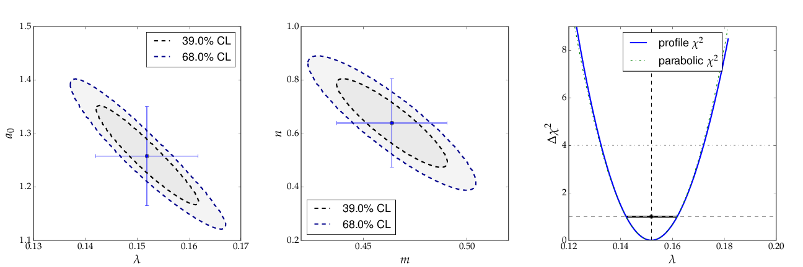
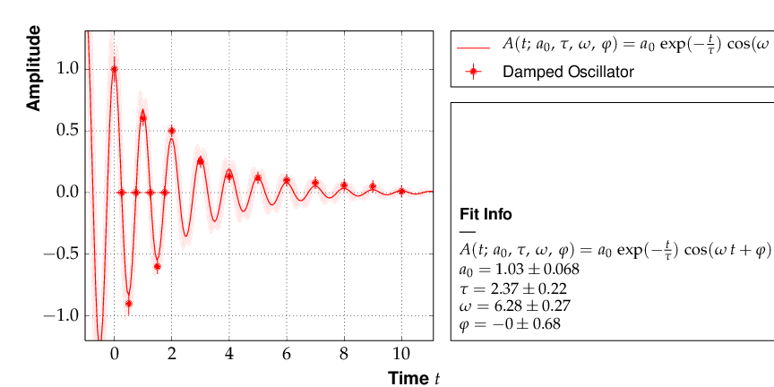

.. meta::
   :description lang=en: kafe - a general, Python-based approach to fit a
      model function to two-dimensional data points with correlated
      uncertainties in both dimensions
   :robots: index, follow

****************************************
Fit examples, utilities, tips and tricks
****************************************

A wide range of applications of the *kafe* core and the usage of
the helper functions is exemplified below. All of them
are contained in the sub-directory ``examples/`` of the
*kafe* distribution and are intended to serve as a basis for
user projects.

Example 1 - model comparison
============================

To decide whether a model is adequate to describe a given
set of data, typically several models have to be fit to the
same data. Here is the code for a comparison of a data set
to two models, namely a linear and an exponential function:

.. code-block:: python

    # import everything we need from kafe
    from kafe import *
    # additionally, import the two model functions we want to fit:
    from kafe.function_library import linear_2par, exp_2par

    ############
    # Load the Dataset from the file
    my_dataset = Dataset(input_file='dataset.dat', title="Example Dataset")
    ### Create the Fits
    my_fits = [Fit(my_dataset, exp_2par),
               Fit(my_dataset, linear_2par)]
    ### Do the Fits
    for fit in my_fits:
    fit.do_fit()
    ### Create the plots, save and show output
    my_plot = Plot(my_fits[0], my_fits[1])
    my_plot.plot_all(show_data_for=0) # show data only once (it's the same data)
    my_plot.save('plot.pdf')
    my_plot.show()

The file `dataset.dat` contains x and y data in the standard *kafe* data
format, where values and errors (and optionally also correlation coefficients)
are given for each axis separately. `#` indicates a comment line, which
is ignored when reading the data::

    # axis 0: x
    # datapoints  uncor. err.
    0.957426  3.0e-01
    2.262212  3.0e-01
    3.061167  3.0e-01
    3.607280  3.0e-01
    4.933100  3.0e-01
    5.992332  3.0e-01
    7.021234  3.0e-01
    8.272489  3.0e-01
    9.250817  3.0e-01
    9.757758  3.0e-01

    # axis 1: y
    # datapoints  uncor. err.
    1.672481  2.0e-01
    1.743410  2.0e-01
    1.805217  2.0e-01
    2.147802  2.0e-01
    2.679615  2.0e-01
    3.110055  2.0e-01
    3.723173  2.0e-01
    4.430122  2.0e-01
    4.944116  2.0e-01
    5.698063  2.0e-01

The resulting output is shown below. As can be seen already
from the graph, the exponential model better describes the
data. The χ² probability in the printed output shows, however,
that the linear model would be marginally acceptable as well::

    linear_2par
    chi2prob 0.052
    HYPTEST  accepted (CL 5%)

    exp_2par
    chi2prob 0.96
    HYPTEST  accepted (CL 5%)

.. figure:: _static/img/kafe_example1.png
   :height: 300px
   :width: 600px
   :scale: 100 %
   :alt: image not found
   :align: center

   `Output of example1 - compare two models`

The contour curves of the two fits are shown below
and reflect the large correlations between the fit parameters.
The right plot of the profile χ² curve shows that there
is a slight deviation from the parabolic curve in the
fist fit of a non-linear (exponential) function. For more
details on the profiled χ² curve see the discussion of
example 3, where the difference is more prominent.

   `Contour curves and a profile χ² curve for the fits in example 1`

Example 2 - two fits and models
===============================

Another typical use case consists of comparing two sets
of measurements and the models derived from them. This is
very similar to the previous example with minor
modifications:

.. code-block:: python

    ...

    ############
    # Workflow #
    ############
    # Load two Datasets from files
    my_datasets = [Dataset(input_file='dataset1.dat', title="Example Dataset 1"),
                   Dataset(input_file='dataset2.dat', title="Example Dataset 2")]
    # Create the Fits
    ...
    # Do the Fits
    ...
    # Create the plots
    my_plot.plot_all()  # this time without any arguments, i.e. show everything
    ...

This results in the following output:

.. figure:: _static/img/kafe_example2.png
   :height: 300px
   :width: 600px
   :scale: 100 %
   :alt: image not found
   :align: center

   `Output of example2 - comparison of two linear fits.`

Although the parameters extracted from the two data sets agree within
errors, the uncertainty bands of the two functions do not overlap
in the region where the data of Dataset 2 are located, so the data
are most probably incompatible with the assumption of an underlying
single linear model.

Example 3 - non-linear fit with non-parabolic errors
=====================================================

Very often, when the fit model is a non-linear function
of the parameters, the χ² function is not parabolic around
the minimum. A very common example of such a case is an
exponential function prarametrised as shown in the code
fragment below. `Minuit` contains a spacial algorithm, `Minos`,
which returns correct errors also in this case. Instead of
using the curvature the minimum, `Minos` follows the
χ² function from the minimum to the point where it
crosses the the value `minimum+up`, where `up=1` corresponds
to one standard deviation in χ² fits. During the scan of the
χ² function at different values of each parameter the minimum
with respect to all other parameters in the fit is determined,
thus making sure that all correlations among the parameters
are taken into account. In case of a parabolic χ² function,
the `Minos` errors are identical to those obtained by
the `Hesse` algorithm, but are typically larger or
asymmetric in other cases.

The method :py:meth:`kafe.do_fit` executes the `Minos` algorithm
after completion of a fit and prints the `Minos` errors if
the deviation from the parabolic result are larger than 5% .

A graphical visualisation is provided
by the method :py:meth:`plot_profile` , which
displays the profile χ² curve for the parameter
with name or index passed as an argument to the method.

The relevant code fragments and the usage of
the method :py:meth:`kafe.fit.plot_profile` are
illustrated here:

.. code-block:: python

    ...
    # definition of the fit function
    @ASCII(x_name="t", expression="A0*exp(-t/tau)")
    # Set some LaTeX-related parameters for this function
    @LaTeX(name='A', x_name="t",
       parameter_names=('A_0', '\\tau{}'),
       expression="A_0\\,\\exp(\\frac{-t}{\\tau})")
    @FitFunction
    def exponential(t, A0=1, tau=1):
       return A0 * exp(-t/tau)
    ...
    # Load the data, perform fit and plot
    my_dataset = Dataset(input_file='dataset.dat', title="Example Dataset")
    my_fit = Fit(my_dataset, exponential)
    my_fit.do_fit()
    my_plot = Plot(my_fit)
    my_plot.plot_all()
    # --> display contours and profile
    contour = my_fit.plot_contour(0, 1, dchi2=[1.,2.3])
    profile1=my_fit.plot_profile(0)
    profile2=my_fit.plot_profile(1)
    # Show the plots
    my_plot.show()

The data points were generated using a normalisation factor
of `A0=1.` and a lifetime `τ=1.`. The resulting fit output
below demonstrates that this is well reproduced within
uncertainties:

.. figure:: _static/img/kafe_example3.png
   :height: 300px
   :width: 600px
   :scale: 100%
   :alt: image not found
   :align: center

   `Output of example 3 - Fit of an exponential`

The contour `A`\ :sub:`0`\  `vs τ`, however, is not an ellipse,
as shown in the figure below. The profiled χ² curves are
also shown; they deviate significantly from parabolas.
The proper one-sigma uncertainty in the sense of a 68%
confidence interval is read from these curves by determining
the parameter values where the χ² curves cross the horizontal
lines at a value of Δχ²=1 above the minimum. The two-sigma
uncertainties correspond to the intersections with the
horizontal line at Δχ²=4.

.. figure:: _static/img/kafe_example3_contours.png
   :height: 300px
   :width: 900px
   :scale: 100%
   :alt: image not found
   :align: center

   `Contour and profile χ² curves of example 3`

Note: a more parabolic behaviour is achieved
by using the width parameter λ=1/τ in the
parametrisation of the exponential function.

Example 4 - average of correlated measurements
==============================================

The average of a set of measurements can be considered as a fit
of a constant to a set of input data. This example illustrates
how correlated errors are handled in *kafe*.
Measurements can have a common error, which may be absolute
or relative, i. e. depend on the input value.  In more complicated
cases the full covariance matrix must be constructed.

*kafe* has a helper function, :py:func:`~kafe.dataset.build_dataset` in module :py:mod:`fit`,
which aids in setting up the covariance matrix and transforming
the input to the default format used by the :py:class:`~kafe.dataset.Dataset` and :py:class:`~kafe.fit.Fit`
classes. Two further helper functions in module :py:mod:`file_tools`
aid in reading the appropriate information from data files.

1. The function  :py:func:`~kafe.file_tools.parse_column_data` reads the input values and their
    independent errors from one file, and optionally covariance
    matrices for the x and y axes from additional files. The field ordering
    is defined by a control string.

2. Another helper function, :py:func:`~kafe.file_tools.buildDataset_fromFile`, specifies
    input values or blocks of input data from a single file with
    keywords.

The second version needs only very minimal additional user
code, as illustrated here:

.. code-block:: python

    from kafe import *
    from kafe.function_library import constant_1par
    from kafe.file_tools import buildDataset_fromFile
    #
    # =========================================================
    fname = 'WData.dat'
    curDataset = buildDataset_fromFile(fname) # Dataset from input file
    curFit = Fit(curDataset, constant_1par)   # set up the fit object
    curFit.do_fit()

    myPlot = Plot(curFit)
    myPlot.plot_all()
    myPlot.save("plot.pdf")
    myPlot.show()

The input file is necessarily more complicated, but holds
the full information on the data set in one place. Refer to
the documentation of the function :py:func:`~kafe.file_tools.parse_general_inputfile`
in module :py:mod:`file_tools` for a full description of the
currently implemented keywords. The input file for the
averaging example is here::

    # Measurements of W boson mass (combined LEP2, 2013)
    # ==================================================
    # example to use parse_general_inputfile from kafe;
    #  covariance matrix build from common errors
    # ==
    #  Meta data for plotting
    *TITLE measurements of the W boson mass
    *xLabel number of measurement
    *yLabel $m_\matrhm{W}$
    *yUnit GeV/$c^2$

    # x data need not be given for averaging

    # ============================================================
    #  Measurements of W mass by ALEPH, DELPI, L3 and OPAL
    #                              from from LEP2 Report Feb. 2013
    #  common errors within channels
    #                     2q2l: 0.021 GeV,
    #                       4q: 0.044 GeV,
    #     and between channels: 0.025 GeV
    # ============================================================

    *yData_SCOV
    # W_mass  err     syst    sqrt of the off-diagonal
    # 2q2l channel                           elements of the
    80.429  0.055   0.021          #         covariance matrix
    80.339  0.073   0.021   0.021
    80.217  0.068   0.021   0.021 0.021
    80.449  0.058   0.021   0.021 0.021 0.021
    # 4q  channel
    80.477  0.069   0.044   0.025 0.025 0.025 0.025 0.044
    80.310  0.091   0.044   0.025 0.025 0.025 0.025 0.044 0.044
    80.324  0.078   0.044   0.025 0.025 0.025 0.025 0.044 0.044 0.044
    80.353  0.068   0.044   0.025 0.025 0.025 0.025 0.044 0.044 0.044 0.044

Example 5 - non-linear multi-parameter fit (damped oscillation)
===============================================================

This example shows the fitting of a more complicated model function
to data collected from a damped harmonic oscillator. In such
non-linear fits, stetting the initial values is sometimes crucial
to let the fit converge at the global minimum. The :py:class:`~kafe.fit.Fit`
object provides the method :py:meth:`~kafe.fit.Fit.set_parameters` for this
purpose. As the fit function for this problem is not a standard one, it is
defined explicitly making use of the decorator functions available in
*kafe* to provide nice type setting of the parameters. This time,
the function :py:func:`~kafe.file_tools.parse_column_data` is used to read
the input, which is given as separate columns with the fields

  ``<time>  <Amplitude>    <error on time>   <error on Amplitude>``

Here is the example code:

.. code-block:: python

    ...
    from kafe import *
    from numpy import exp, cos
    # Model function definition #
    # ===========================
    # Set an ASCII expression for this function
    @ASCII(x_name="t", expression="A0*exp(-t/tau)*cos(omega*t+phi)")
    # Set some LaTeX-related parameters for this function
    @LaTeX(name='A', x_name="t",
           parameter_names=('a_0', '\\tau{}', '\\omega{}', '\\varphi{}'),
           expression="a_0\\,\\exp(-\\frac{t}{\\tau})\,"
                      "\cos(\\omega{}\\,t+\\varphi{})")
    @FitFunction
    def damped_oscillator(t, a0=1, tau=1, omega=1, phi=0):
        return a0 * exp(-t/tau) * cos(omega*t + phi)

    # ---- Workflow #
    # load the experimental data from a file
    my_dataset = parse_column_data('damped_oscillation.dat',
        field_order="x,y,xabserr,yabserr", title="Damped Oscillator",
        axis_labels=['Time t', 'Amplitude'])
    # --- Create the Fit
    my_fit = Fit(my_dataset, damped_oscillator)
    # Set the initial values for the fit:
    #                      a_0 tau omega phi
    my_fit.set_parameters((1., 2., 6.28, 0.8))
    my_fit.do_fit()
    # --- Create and output the plots
    my_plot = Plot(my_fit)
    my_plot.plot_all()
    #my_plot.save('plot.pdf')
    my_fit.plot_correlations() # all contours and profiles
    my_plot.show()

This is the resulting output:

   `Example 5 - fit of the time dependence of the amplitude of a damped harmonic oscillator.`

The fit function is non-linear, and, furthermore, there ist not a single
local minimum - e.g. a shift in phase of 180° corresonds to a change in
sign of the amplitude, and valid solutions are also obtained for multiples
of the base frequency. Checking of the validity of the fit result is
threfore important. The method
:py:meth:`~kafe.fit.Fit.plot_correlations` provides the
contours of all pairs of parameters and the profiles for each of
the parameters and displays them in a matrix-like arrangement.
Distorted contour-ellipses show wether the result is affected
by near-by minima, and the profiles allow to correctly assign
the parameter uncertainties in cases where the parabolic
approximation is not precise enough.

.. figure:: _static/img/kafe_example5_correlations.png
   :height: 900px
   :width: 900px
   :scale: 75 %
   :alt: image not found
   :align: center

   `Confidence contours and profiles for example 5.`

Example 6 - linear multi-parameter fit
======================================

This example is not much different from the previous one, except that
the fit function, a standard fourth-degree polynomial from the module
:py:mod:`function_library`, is modified to reflect the names of the problem
given, and :py:mod:`matplotlib` functionality is used to influence the
output of the plot, e.g. axis names and linear or logarithmic scale.

It is also shown how to circumvent a problem that
often arises when errors depend on the measured values.
For a counting rate, the (statistical) error is typically estimated
as the square root of the (observed) number of entries in each bin.
For large numbers of entries, this is not a problem,
but for small numbers, the correlation between the observed
number of entries and the error derived from it leads to a
bias when fitting functions to the data. This problem can be
avoided by iterating the fit procedure:

In a pre-fit, a first approximation of the model function is
determined, which is then used to calculate
the expected errors, and the original errors are
replaced before performing the final fit. Note that the numbers
of entries in the bins must be sufficiently large to justify
a replacement of the (asymmetric) Poisson uncertainties by
the symmetric uncertainties implied by the χ²-method.

The implementation of this  procedure needs accesses some
more fundamental methods of the `Dataset`, `Fit` and
`FitFunction` classes. The code shown below demonstrates
how this can be done with *kafe*, using some of its lower-level,
internal interfaces:

.. code-block:: python

    from kafe.function_library import poly4
    # modify function's independent variable name to reflect its nature:
    poly4.x_name = 'x=cos(t)'
    poly4.latex_x_name = 'x=\\cos(\\theta)'
    ...

    # Set the axis labels appropriately
    my_plot.axis_labels = ['$\\cos(\\theta)$', 'counting rate']
    ...
    # load the experimental data from a file
    my_dataset = parse_column_data(
      'counting_rate.dat',
      field_order="x,y,yabserr",
      title="Counting Rate per Angle")

    ### pre-fit
    # error for bins with zero contents is set to 1.
    covmat = my_dataset.get_cov_mat('y')
    for i in range(0, len(covmat)):
        if covmat[i, i] == 0.:
            covmat[i, i] = 1.
    my_dataset.set_cov_mat('y', covmat) # write it back

    # Create the Fit
    my_fit = Fit(my_dataset, poly4)
    #            fit_label="Linear Regression " + dataset.data_label[-1])

    # perform an initial fit with temporary errors (minimal output)
    my_fit.call_minimizer(final_fit=False, verbose=False)

    # set errors using model at pre-fit parameter values:
    #       sigma_i^2=cov[i, i]=n(x_i)
    fdata = my_fit.fit_function.evaluate(my_fit.xdata,
                                       my_fit.current_parameter_values)
    np.fill_diagonal(covmat, fdata)
    my_fit.current_cov_mat = covmat  # write new covariance matrix
    ### end pre-fit - rest is as usual
    my_fit.do_fit()
    # Create the plots and ==
    my_plot = Plot(my_fit)
    # -- set the axis labels
    my_plot.axis_labels = ['$\\cos(\\theta)$', 'counting rate']
    # -- set scale linear / log
    my_plot.axes.set_yscale('linear')
    ...

This is the resulting output:

.. figure:: _static/img/kafe_example6.png
   :height: 300px
   :width: 600px
   :scale: 100 %
   :alt: image not found
   :align: center

   `Output of example 6 - counting rate.`

Example 7 - another non-linear multi-parameter fit (double-slit spectrum)
=========================================================================

Again, not much new in this example, except that the
model is now very non-linear, the intensity distribution
of light after passing through a double-slit. The
non-standard model definition again makes use of the
decorator mechanism to provide nice output - the decorators
(expressions beginning with '@') can safely be omitted if `LaTeX`
output is not needed. Setting of appropriate initial
conditions is absolutely mandatory for this example,
because there  exist many local minima of the χ² function.

Another problem becomes obvious when carefully inspecting
the fit function definition: only two of the three parameters g,
b or k can be determined, and therefore one must be kept fixed,
or an external constraint must be applied.
Failing to do so will result in large, correlated errors
on the parameters g, b and k as an indication of the problem.

Fixing parameters of a model function is achieved by the method
:py:meth:`~kafe.fit.Fit.fix_parameters`, and a constraint within a given uncertainty
is achieved by the method :py:meth:`~kafe.fit.Fit.constrain_parameters`
of the :py:class:`~kafe.fit.Fit` class.

Here are the interesting pieces of code:

.. code-block:: python

    ...
    # Model function definition #
    # Set an ASCII expression for this function
    @ASCII(x_name="x", expression="I0*(sin(k/2*b*sin(x))/(k/2*b*sin(x))"
                                  "*cos(k/2*g*sin(x)))^2")
    # Set some LaTeX-related parameters for this function
    @LaTeX(name='I', x_name="\\alpha{}",
           parameter_names=('I_0', 'b', 'g', 'k'),
           expression="I_0\\,\\left(\\frac{\\sin(\\frac{k}{2}\\,b\\,\\sin{\\alpha})}"
                      "{\\frac{k}{2}\\,b\\,\\sin{\\alpha}}"
                      "\\cos(\\frac{k}{2}\\,g\\,\\sin{\\alpha})\\right)^2")
    @FitFunction
    def double_slit(alpha, I0=1, b=10e-6, g=20e-6, k=1.e7):
        k_half_sine_alpha = k/2*sin(alpha)  # helper variable
        k_b = k_half_sine_alpha * b
        k_g = k_half_sine_alpha * g
        return I0 * (sin(k_b)/(k_b) * cos(k_g))**2

    ...

    # Set the initial values for the fit
    #                      I   b      g        k
    my_fit.set_parameters((1., 20e-6, 50e-6, 9.67e6))
    # fix one of the (redundant) parameters, here 'k'
    my_fit.fix_parameters('k')

    ...

If the parameter `k` in the example above has a (known) uncertainty,
is is more appropriate to constrain it within its uncertainty (which
may be known from an independent measurement or from the specifications
of the laser used in the experiment). To take into account a
wave number `k` known with a precision of 10'000 the
last line in the example above should be replaced by:

.. code-block:: python

    ...
    my_fit.constrain_parameters(['k'], [9.67e6], [1.e4])
    ...

This is the resulting output:

.. figure:: _static/img/kafe_example7.png
   :height: 300px
   :width: 600px
   :scale: 100 %
   :alt: image not found
   :align: center

   `Example 7 - fit of the intensity distribution of light behind a double slit with fixed or constrained wave length.`

.. _example_8:

Example 8 - fit of a Breit-Wigner resonance to data with correlated errors
==========================================================================

This example illustrates how to define the data and the fit function
in a single file - provided by the helper function :py:func:`~kafe.file_tools.buildFit_fromFile`
in module :py:mod:`file_tools`. Parsing of the input file is done by the
function :py:func:`~kafe.file_tools.parse_general_inputfile`, which had already been introduced
in Example 4. The definition of the fit function as `Python` code
including the *kafe* decorators in the input file, however, is new.
Note: because spaces are used to to separate data  fields in the
input file, spaces needed for proper `Python` indentation have to be
replaced by '~'. The last key in the file defines the start values
of the parameters and their initial ranges.

The advantage of this approach is the location of all data
and the fit model in one place, which is strictly separated
from the `Python` code. The `Python` code below is thus very general
and can handle a large large variety of problems without
modification (except for the file name, which could easily be
passed on the command line):

.. code-block:: python

    from kafe import *
    from kafe.file_tools import buildFit_fromFile
    # --------------------------------------------------------
    fname = 'LEP-Data.dat'
    # initialize fit object from file
    BWfit = buildFit_fromFile(fname)
    BWfit.do_fit()
    #
    BWplot = Plot(BWfit)
    BWplot.plot_all()
    BWplot.save("plot.pdf")
    BWplot.show()

The magic happens in the input file, which now has to provide
all the information needed to perform the fit::

    # Measurements of hadronic Z cross sections at LEP
    # ------------------------------------------------
    # this file is to be parsed with 
    #          kafe.file_tools.buildFit_fromFile()
    
    #  Meta data for plotting
    *TITLE  LEP Hadronic Cross Section ($\sigma^0_\mathrm{had}$)
    *BASENAME example8_BreitWigner
    *xLabel $E_{CM}$
    *xUnit  $\mathrm{GeV}$
    *yLabel $\sigma^0_{\mathrm{had}}$
    *yUnit  $\mathrm{nb}$
    
    #----------------------------------------------------------------------
    # DATA: average of hadronic cross sections measured by
    #  ALEPH, DELPHI, L3 and OPAL around 7 energy points at the Z resonance
    #----------------------------------------------------------------------
    
    # CMenergy E err 
    *xData
       88.387  0.005  
       89.437  0.0015 
       90.223  0.005  
       91.238  0.003  
       92.059  0.005  
       93.004  0.0015 
       93.916  0.005
    
    # Centre-of-mass energy has a common uncertainty  
    *xAbsCor 0.0017 
    
    # sig^0_h  sig err     #  rad.cor  sig_h measured
    *yData
       6.803   0.036      #  1.7915    5.0114
       13.965  0.013      #  4.0213    9.9442
       26.113  0.075      #  7.867    18.2460
       41.364  0.010      #  10.8617  30.5022
       27.535  0.088      #  3.9164   23.6187
       13.362  0.015      # -0.6933   14.0552
        7.302  0.045      # -1.8181    9.1196
    
    # cross-sections have a common relative error
    *yRelCor 0.0007 
    
    *FITLABEL Breit-Wigner-Fit \, {\large{(with~s-dependent~width)}} 
    
    *FitFunction
    # Breit-Wigner with s-dependent width
    @ASCII(name='sigma', expression='s0*x^2*G^2/[(E^2-M^2)^2+(E^4*G^2/M^2)]')
    @LaTeX(name='\sigma', parameter_names=('\\sigma^0', 'M_Z','\\Gamma_Z'),
    expression='\\frac{\\sigma^0\\, M_Z^2\\Gamma^2}'
                     '{((E^2-M_Z^2)^2+(E^4\\Gamma^2 / M_Z^2))}') 
    @FitFunction
    def BreitWigner(E, s0=41.0, M=91.2, G=2.5):
        return s0*E*E*G*G/((E*E-M*M)**2+(E**4*G*G/(M*M)))
    
    
    *InitialParameters  # initial values and range
    41.  0.5
    91.2 0.1 
    2.5  0.1
    
    #---------------------------------------------------------------------------
    #### official results (LEP Electroweak Working Group):
    #### s0=41.540+/-0.037nb  M=91.1875+/-0.0021GeV/c^2  G=2.4952+/-0.0023 GeV
    ####  uses all decay modes of the Z and full cross-section list
    #---------------------------------------------------------------------------

Here is the output:

.. figure:: _static/img/kafe_BreitWignerFit.png
   :height: 300px
   :width: 600px
   :scale: 100 %
   :alt: image not found
   :align: center

   `Output of example 8 - Fit of a Breit-Wigner function.`

This example also contains a code snippet demonstrating how to plot
contours by calling the :py:class:`~kafe.fit.Fit` object's
:py:meth:`~kafe.fit.Fit.plot_contour` method. This is the code:

.. code-block:: python

   # plot pairs of contours at 1 sigma, 68%, 2 sigma and 95%
   cont_fig1 = BWfit.plot_contour(0, 1, dchi2=[1.,2.3,4.,5.99])
   cont_fig2 = BWfit.plot_contour(0, 2, dchi2=[1.,2.3,4.,5.99])
   cont_fig3 = BWfit.plot_contour(1, 2, dchi2=[1.,2.3,4.,5.99])
   # save to files
   cont_fig1.savefig("kafe_BreitWignerFit_contour12.pdf")
   cont_fig2.savefig("kafe_BreitWignerFit_contour13.pdf")
   cont_fig3.savefig("kafe_BreitWignerFit_contour23.pdf")

The resulting pictures show that parameter correlations are
relatively small:

.. figure:: _static/img/kafe_BreitWignerFit_contours.png
   :height: 300px
   :width: 900px
   :alt: image not found
   :align: center

   `Contours generated in example 8 - Fit of a Breit-Wigner function.`

Example 9 - fit of a function to histogram data
===============================================

This example brings us to the limit of what is currently
possible with *kafe*. Here, the data represent the
center of a histogram bins ad the number of entries, :math:`n_i`,
in each bin. The (statistical) error is typically estimated
as the square root of the (observed) number of entries in each bin.
For large numbers of entries, this is not a problem,
but for small numbers, especially for bins with 0 entries,
the correlation between the observed number of entries and
the error derived from it leads to a bias when fitting
functions to the histogram data. In particular, bins with
zero entries cannot be handled in the χ²-function, and are
typically omitted to cure the problem.  However, a bias
remains, as bins with downward fluctuations of the
observed numbers of events get assigned smaller errors
and hence larger weights in the fitting procedure - leading
to the aforementioned bias.

These problems are avoided by using a likelihood method for
such use cases, where the Poisson distribution of the uncertainties
and their dependence on the values of the fit model is properly
taken into account. However, the χ²-method can be saved to some
extend if the fitting procedure is iterated. In a pre-fit, a
first approximation of the model function is determined, where
the error in bins with zero entries is set to one. The model
function determined from the pre-fit is then used to calculate
the expected errors for each bin, and the original errors are
replaced before performing the final fit. Note that the numbers
of entries in the bins must be sufficiently large to justify
a replacement of the (asymmetric) Poisson uncertainties by
the symmetric uncertainties implied by the χ²-method.

The code shown below demonstrates
how to get a grip on such more complex procedures with
more fundamental methods of the `Dataset`, `Fit` and
`FitFunction` classes:

.. code-block:: python

    ...
    # Load Dataset from file
    hdataset = Dataset(input_file='hdataset.dat', title="Data for example 9")

    # error for bins with zero contents is set to 1.
    covmat = hdataset.get_cov_mat('y')
    for i in range(0, len(covmat)):
        if covmat[i, i] == 0.:
            covmat[i, i] = 1.
    hdataset.set_cov_mat('y', covmat) # write it back

    # Create the Fit instance
    hfit = Fit(hdataset, gauss, fit_label="Fit of a Gaussian to histogram data")
    #
    # perform an initial fit with temporary errors (minimal output)
    hfit.call_minimizer(final_fit=False, verbose=False)
    #
    #re-set errors using model at pre-fit parameter values:
    #        sigma_i^2=cov[i, i]=n(x_i)
    fdata=hfit.fit_function.evaluate(hfit.xdata, hfit.current_parameter_values)
    np.fill_diagonal(covmat, fdata)
    hfit.current_cov_mat = covmat # write back new covariance matrix
    #
    # now do final fit with full output
    hfit.do_fit()
    # and create, draw, save and show plot
    ...

Here is the output, which shows that the parameters of the
standard normal distribution, from which the data were generated,
are reproduced well by the fit result:

.. figure:: _static/img/kafe_example9.png
   :height: 300px
   :width: 600px
   :scale: 100 %
   :alt: image not found
   :align: center

   `Output of example 9 - Fit of a Gaussian distribution to histogram data`

Example 10 - plotting with *kafe*: properties of a Gauss curve
======================================================================

This example shows how to access the *kafe* plot objects
to annotate plots with :py:mod:`matplotlib` functionality.

A dummy object :py:class:`~kafe.dataset.Dataset` is
created with points lying exactly on a Gaussian curve.
The :py:class:`~kafe.fit.Fit` will then converge toward
that very same Gaussian. When plotting, the data points
used to "support" the curve can be omitted.

.. figure:: _static/img/kafe_example10.png
   :height: 300px
   :width: 600px
   :scale: 100 %
   :alt: image not found
   :align: center

   `Output of example 10 - properties of a Gauss curve.`

