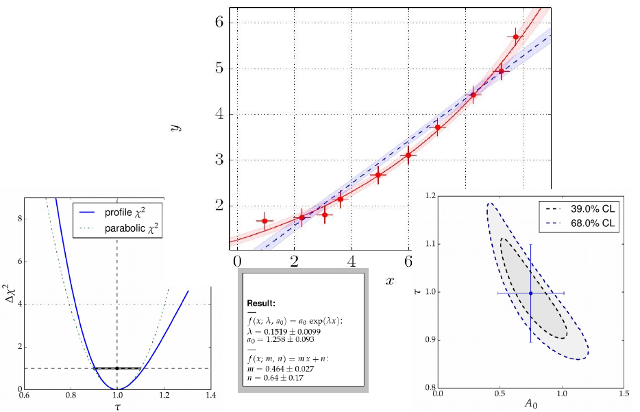

*kafe* Overview
===============

   `Graphical output generated with kafe`.

The *kafe* package provides a rather general approach to fitting of
a model function to two-dimensional data points with correlated uncertainties
in both dimensions. The Python API guarantees full flexibility
for data input. Helper functions for file-based input and some
examples are available for own applications.

Applications range from performing a simple average of measurements
to complex situations with both correlated (systematic) and
uncorrelated (statistical) uncertainties on the measurements
of the x and y values described by a non-linear model function
depending on a large number of parameters.

The model function describes the y values as a function of the
x-values and a set of model parameters {p}, `y=f(x; {p})`. Full
flexibility exists as model functions are implemented as
Python code. Again, examples are provided, but user
implementations are supported as well.

Fitting is based on the χ²-method, assuming Gaussian errors and
correlations described by covariance matrices. The level of agreement
between data points and the fit model is expressed in terms of the
`χ² probability`, i. e. the probability to find less agreement between
data and model than actually observed. Full access to the covariance
matrix of the - typically correlated - model parameters is provided.

The graphical output visualises the data and the fit model at the
best-fit-point of the parameters and also shows the uncertainty
of the fit model as a light band surrounding the line representing
the model function. Plotting of confidence level contours for pairs
of parameters or profiling of the χ² curves for each of the fit
parameters are also provided.

Code Structure
--------------

.. figure:: _static/img/kafeDiagram.jpg
   :height: 300px
   :width: 600px
   :scale: 80 %
   :alt: image not found
   :align: right

   `Code structure of the kafe package`

The code of *kafe* is centred around very few classes to handle Data input,
fitting and plotting, as illustrated in the figure on the right-hand side.

Data, their uncertainties, and, optionally, the correlations of the
uncertainties - are passed through the interface of the *kafe* class
:py:class:`~kafe.dataset.Dataset`. Input can be included in the Python code
or is read from files in standardised or user-defined formats. The representation
of the data within the :py:class:`~kafe.dataset.Dataset` class is minimalistic,
consisting of the x and y values and the full covariance matrices of their
uncertainties. Correlated errors between x and y values are not
supported yet, as such use cases are rare.

A helper function, :py:func:`~kafe.dataset_tools.build_dataset`, is available
to transform various error models, like a combination of independent
and correlated errors or common absolute or relative errors, to this
basic format.

Adding a model function, taken either from a prepared set of fit
functions within kafe or from a user's own Python implementation,
results in a :py:class:`~kafe.fit.Fit` object, which controls the
minimizer :py:class:`~kafe.minuit.Minuit`. Access to the final
results of the fitting procedure is provided by data members of
the `Fit` class.

One or multiple fit objects, i. e. the input data and model
functions(s) at the best-fit point in parameter-space, are
visualised by the class :py:class:`~kafe.plot.Plot` with the help
of :py:mod:`matplotlib` functionality. The :py:mod:`plot` module
also contains functionality to display the model uncertainty by
surrounding the model function at the best-fit values of the parameters
by a light band, the one-σ uncertainty band, which is obtained by
propagation of the uncertainties of the fit parameters taking
into account their correlations.

Two-dimensional contour lines of pairs of parameters
are obtained with the method :py:meth:`~kafe.fit.Fit.plot_contour`
of the :py:class:`Fit` class, which internally relies on the
`mncont` method of the `Minuit` package. Contour curves are
obtained from a scan of the χ²-function around a fixed value,
where each point on the curve represents the minimum with
respect to all other free parameters in the fit, thus taking
into account the correlation of the considered pair of parameters
with all other parameters of the model.

In a similar way, the method :py:meth:`~kafe.fit.Fit.plot_profile`
provides profiled χ² curves, i. e. the value of the minimal
χ² as a function of one parameter while all other parameters
are allowed to vary.

Fitting in a Nutshell
---------------------

Fitting with **kafe** in a nutshell goes like this:

1. create a :py:class:`~kafe.dataset.Dataset` object from your measurement
   data:

    >>> my_d = kafe.Dataset(data=[[0., 1., 2.], [1.23, 3.45, 5.62]])

2. add errors (uncertainties) to your :py:class:`~kafe.dataset.Dataset`:

    >>> my_d.add_error_source('y', 'simple', 0.5)  # y errors, all +/- 0.5

3. import a model function from :py:class:`kafe.function_library` (or
   define one yourself):

    >>> from kafe.function_library import linear_2par

4. create a :py:class:`~kafe.fit.Fit` object from your
   :py:class:`~kafe.dataset.Dataset` and your model function:

    >>> my_f = kafe.Fit(my_d, linear_2par)

5. do the fit:

    >>> my_f.do_fit()

6. *(optional)* if you want to see a plot of the result, use the
   :py:class:`~kafe.plot.Plot` object:

    >>> my_p = kafe.Plot(my_f)
    >>> my_p.plot_all()
    >>> my_p.show()

Example
-------

Only very few lines of Python code are needed to perform fits with
kafe. The snippet of code shown below performs a fit of a quadratic
function to some data points with uncertainties:

.. code-block:: python

    from kafe import *
    from kafe.function_library import quadratic_3par

    #### build a Dataset instance:
    myDataset = build_dataset(
        [0.05,0.36,0.68,0.80,1.09,1.46,1.71,1.83,2.44,2.09,3.72,4.36,4.60],
        [0.35,0.26,0.52,0.44,0.48,0.55,0.66,0.48,0.75,0.70,0.75,0.80,0.90],
        yabserr=[0.06,0.07,0.05,0.05,0.07,0.07,0.09,0.1,0.11,0.1,0.11,0.12,0.1],
        title='some data',
        axis_labels=['$x$', '$y=f(x)$'])

    #### Create the Fit object
    myFit = Fit(myDataset, quadratic_3par)
    # Set initial values and error estimates
    myFit.set_parameters((0., 1., 0.2), (0.5, 0.5, 0.5))
    # Do the Fit
    myFit.do_fit()

    #### Create result plots and output them
    myPlot = Plot(myFit)
    myPlot.plot_all()
    myPlot.save('kafe_example0.pdf') # to file

    myPlot.show()                    # to screen

The output in text form (also available via various :py:meth:`get_...` methods
of the :py:class:`~kafe.fit.Fit` class) contains the values of the parameters
at the best-fit point, their correlation matrix and the fit probability.
The example produces the following graphical output:

.. figure:: _static/img/kafe_example0.png
   :height: 300px
   :width: 600px
   :scale: 100 %
   :alt: image not found
   :align: center

   Example: `Data points with one-dimensional error bars compared
   to a quadratic model function with` **kafe**.

The parametrisation chosen in this example leads to a
strong correlation of the fit parameters. This can
be graphically visualised by adding the following
lines at the end of the example:

.. code-block:: python

    ### Create and save contour plots
    contour1 = myFit.plot_contour(0, 1, dchi2=[1., 2.3])
    contour2 = myFit.plot_contour(0, 2, dchi2=[1., 2.3])
    contour3 = myFit.plot_contour(1, 2, dchi2=[1., 2.3])
    contour1.savefig('kafe_example0_contour1.pdf')
    contour2.savefig('kafe_example0_contour2.pdf')
    contour3.savefig('kafe_example0_contour3.pdf')

The example code produces two confidence-level contours
for each pair of parameters (with `id=0`, `id=1` and `id=2`),
corresponding to an increase of the χ²-function
with respect to the minimum by the values given
in the list passed as the third parameter to the
method :py:meth:`myFit.plot_contour`. The resulting
graphical representation, as shown below, displays the
39% contours, corresponding to the one-sigma errors, and
the 68% contours. The uncertainties on each parameter,
indicated by the error bars, are also shown. They
correspond to the projections of the one-sigma contours
on the axes.

.. figure:: _static/img/kafe_example0_contours.png
   :height: 300px
   :width: 900px
   :alt: image not found
   :align: center

   `Contour curves of a pairs of paramters a, b and c
   of the example above, calculated with` **kafe**.

More and advanced examples - like fitting different models
to one data set, comparison of different data sets with model
functions, averaging of correlated measurements or fits with
a large number of parameters -
are provided as part of the *kafe* distribution and are
described in the section `Examples` below. They may serve as
a starting point for own applications.
